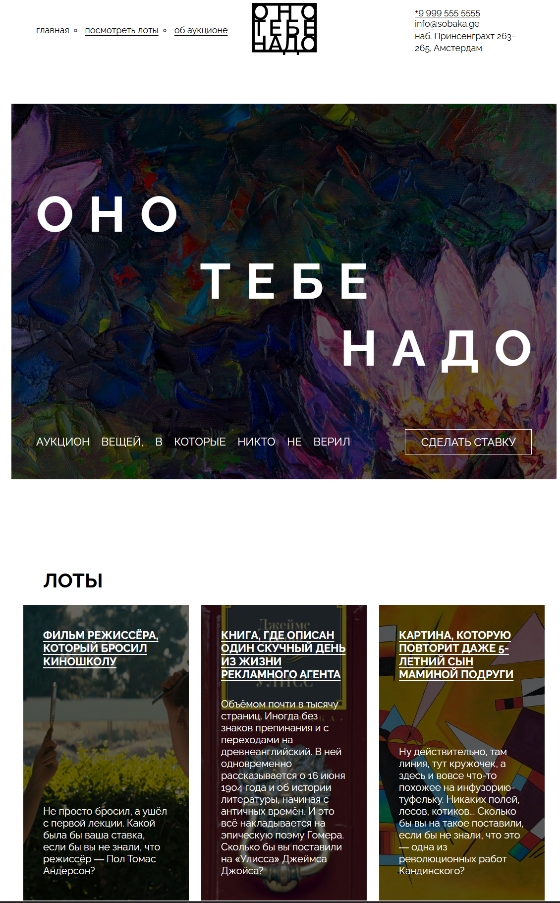

https://github.com/vimanshin/ono-tebe-nado-fd

# Яндекс.Практикум — Проект: оно тебе надо

Это мой первый проект [Яндекс.Практикум](#0).

## Содержание

- [Обзор](#обзор)
  - [Задача](#задача)
  - [Скриншот](#скриншот)
  - [Ссылки](#ссылки)
- [Процесс работы](#процесс-работы)
  - [Стек технологий](#стек-технологий)
  - [Чему я научился](#чему-я-научился)
- [Автор](#автор)

## Обзор

### Задача

Проект должен соотвествовать учебному макету.

### Скриншот

### Ссылки

- URL живого сайта: [Ссылка на живой сайт](https://vimanshin.github.io/ono-tebe-nado-fd/)

## Процесс работы

### Стек технологий

- Семантическая разметка HTML5
- CSS
- Flexbox
- Grid

### Чему я научился

- Семантическая HTML-структура с BEM
- Flexbox для центрирования и вёрстки
- Box model, border-radius
- Остались вопросы, как сделать лучше, есть отклонения от учебного макета. Может сам макет с ошибками?

## Автор

- Vitalii Manshin
